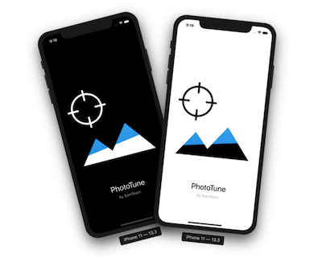
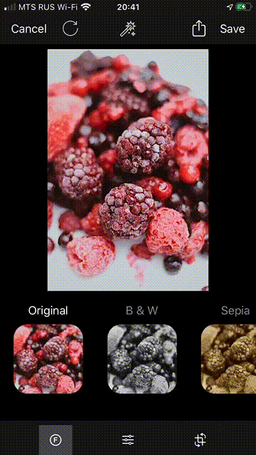

# PhotoTune

Uses Apple's Core Image framework for photo proccessing. Supports iOS 11+.
Instruments: Brightness, Contrast, Saturation, Sharpness, Vignette, Rotation.
## Main features:
###  Dark Theme
Required iOS 13+.

### Autoenhance
Click one button and your photo will be automatically improved.

### Resizing image for best perfomance.
It doesn't matter what size of the imported image. But you can choose Full resolution when exporting.

### Localization
Supporting languages: English, Russian, Japanesse.

### Various Image Sources
You can use Camera, Photolibrary, or Unsplash (internet connection required) as image source.

